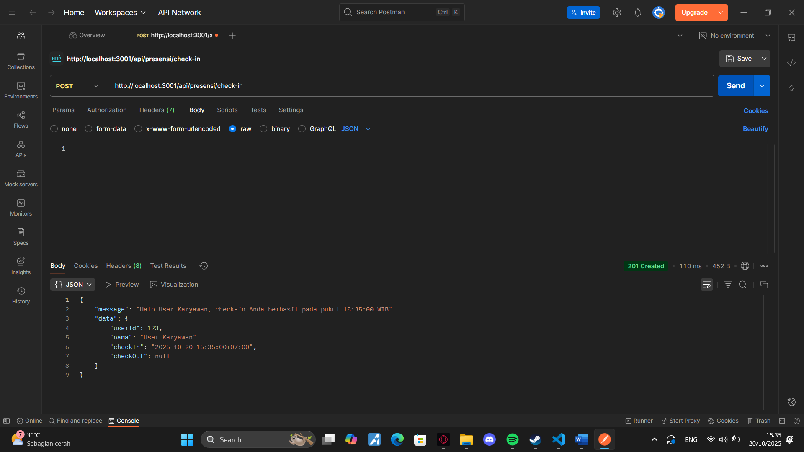
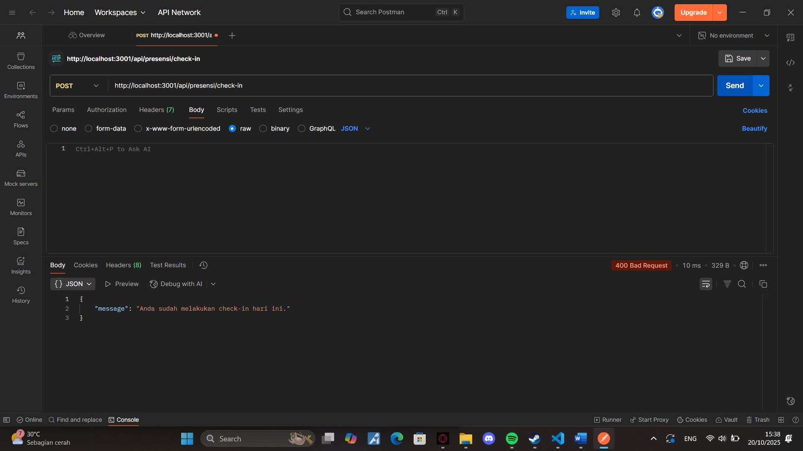
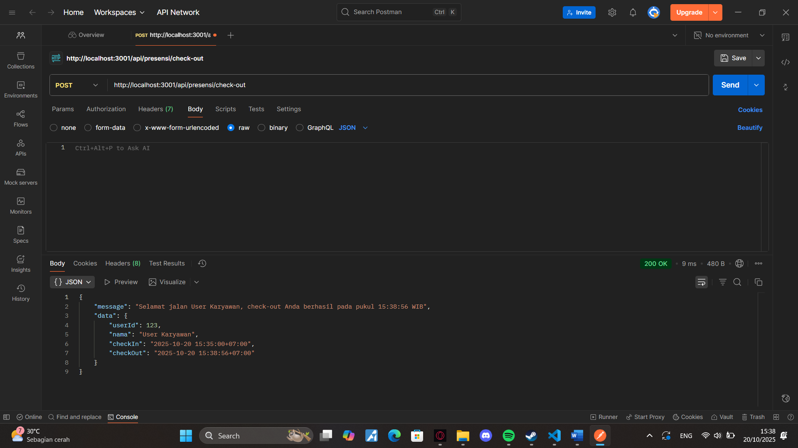
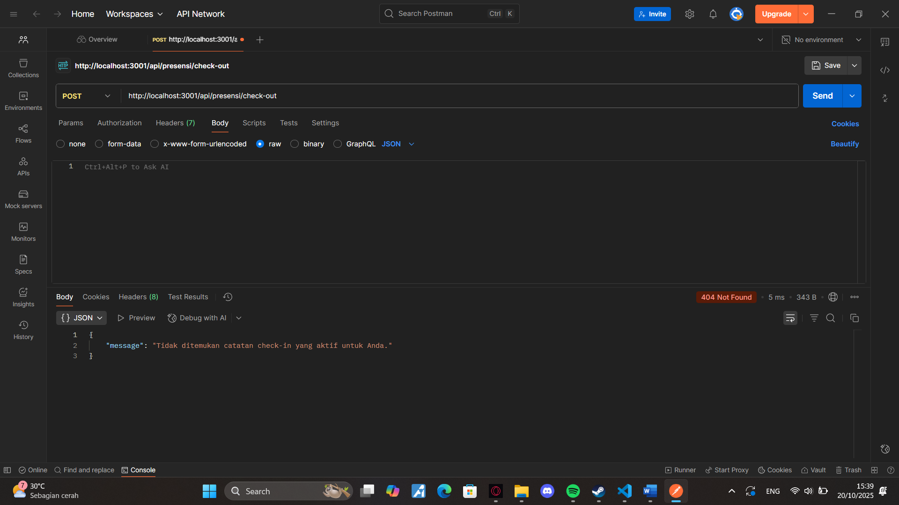
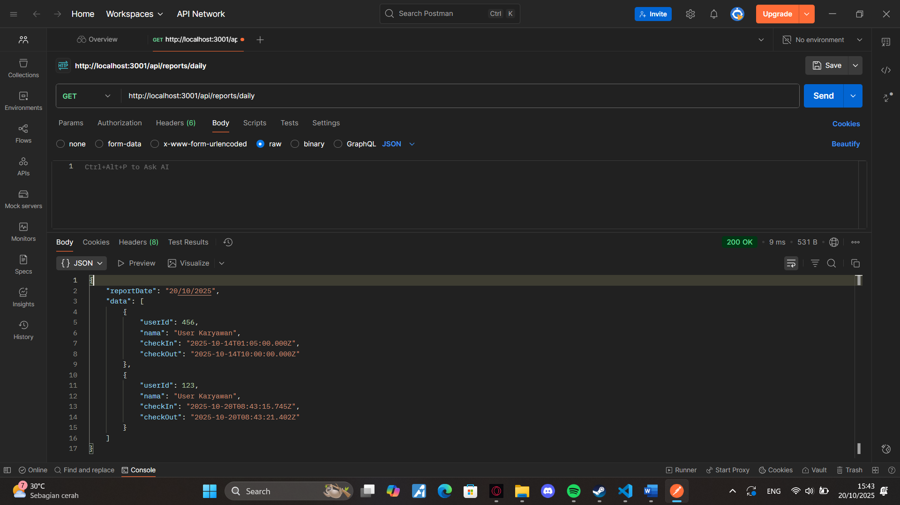
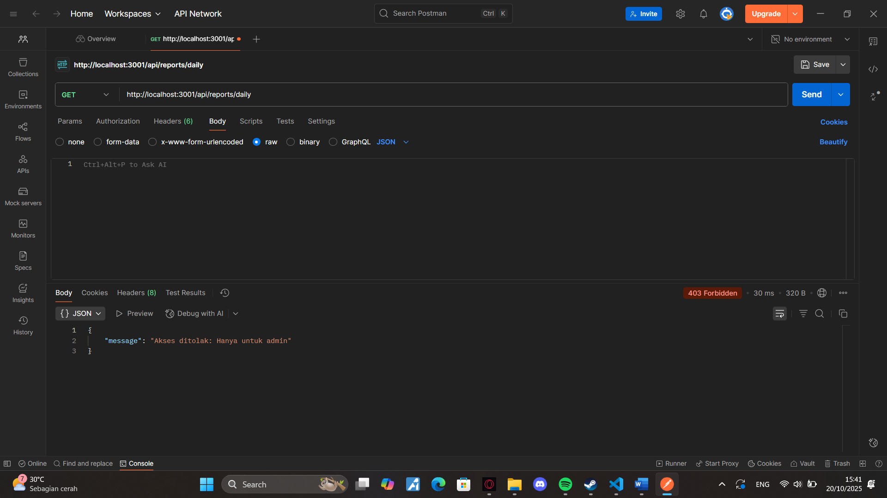

## Tugas 3

## POST /api/presensi/check-in
- Berhasil check-in

- lebih dari 1x check-in

## POST /api/presensi/check-out
- berhasil check-out

- lebih dari 1x check-in

## GET /api/reports/daily
- Admin

- Bukan admin
